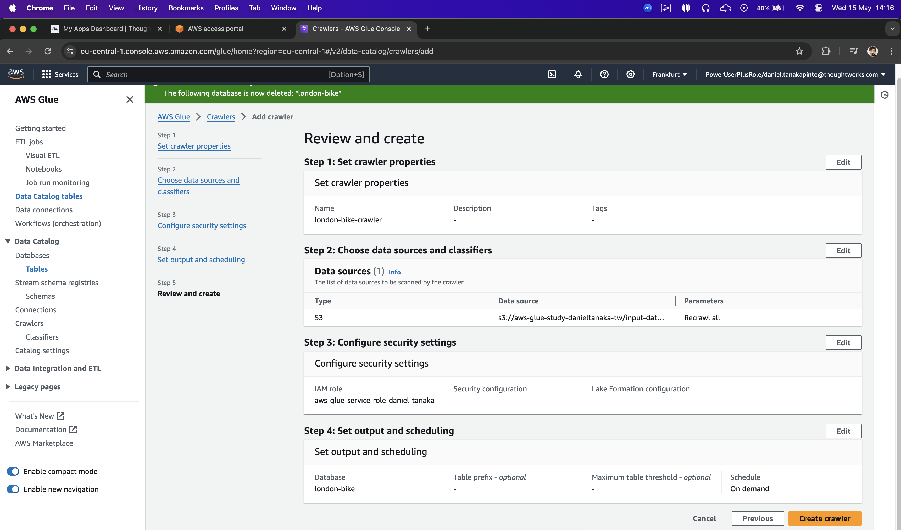
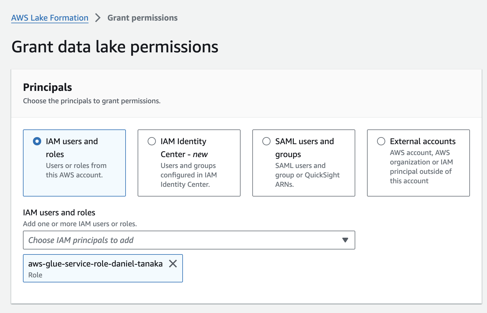
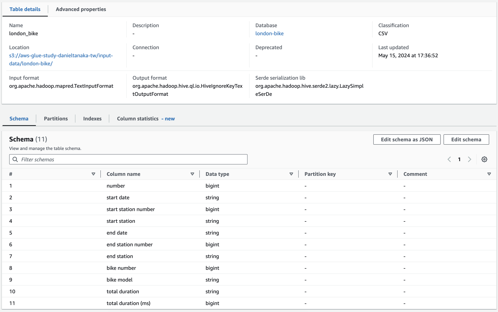
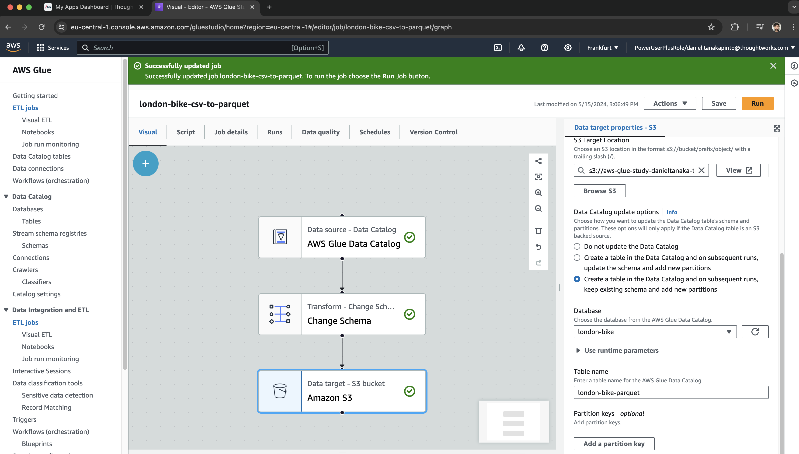
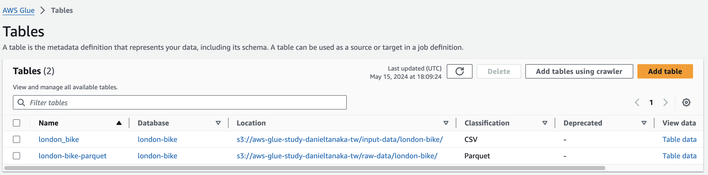

# Glue Study

Study to get in touch with Glue and create a basic data pipeline.

# Objectives

- Create S3 Bucket and populate
- Create IAM role with appropriate permissions for AWS Glue
- Create Glue Database
- Create and Run Crawler
- Create ETL Job to transform CSV to Parquet
- Create ETL Job to enrich data

## Creating a s3 bucket and populating
``` shell
aws s3api create-bucket \
    --bucket aws-glue-study-danieltanaka-tw \
    --region eu-central-1 \
    --create-bucket-configuration LocationConstraint=eu-central-1
```

After that, create folders with the name `input-data/london-bike`, `raw-data/london-bike` and `aggregated-data/london-bike`. Populate the folder input-data with any dataset of your interest. Use the following dataset to populate the input-data directory - https://www.kaggle.com/datasets/kalacheva/london-bike-share-usage-dataset

## Creating IAM role with appropriate permissions for AWS Glue
It is possible to create it via console - go to create role, select the trusted entity as Glue and finally add the permission policy AWSGlueServiceRole.

## Creating a Glue Database
Add a database named `london-bike` and set the location with your s3 URI. Example - s3://glue-study-danieltanaka-tw/input-data/london-bike/. After creating the table, grant the correct permissions via https://eu-central-1.console.aws.amazon.com/lakeformation/home?region=eu-central-1#databases. You should add the IAM role created in the previous step adding Super permissions.




## Creating a Glue Table using crawler
Into the database menu, go to tables and click 'Add tables using crawler'. Click in add data source and add the data using and S3 path. Example: `s3://aws-glue-study-danieltanaka-tw/input-data/london-bike/`. After that, add the IAM role that was previosly created and define the output database as 'london-bike' (same as created before). In the crawler menu, select your newly created crawler and click run.

## Check the table data schema created by the crawler


## Creating an ETL to transform CSV data to Parquet using visual editor
Use the visual editor and add the steps `AWS Glue Data Catalog` pointing to the correct database and table as source. After that, add the `Change Schema` box. Finally, add a data target as Amazon S3. Point the location as `s3://aws-glue-study-danieltanaka-tw/raw-data/london-bike/` defining it to save as parquet and to Create a table in the Data Catalog. Click save and Run, this will convert the .csv file to a .parquet format that we are going to consider as our raw layer of a datalake. The generated script can be checked in the file `csv-to-parquet.py`.



## Creating an ETL to aggregate data using pyspark job
Now that we have data written as parquet, we are going to implement an ETL job using a pyspark job with a script editor. Use the model provided - `london-bike-agg.py`.